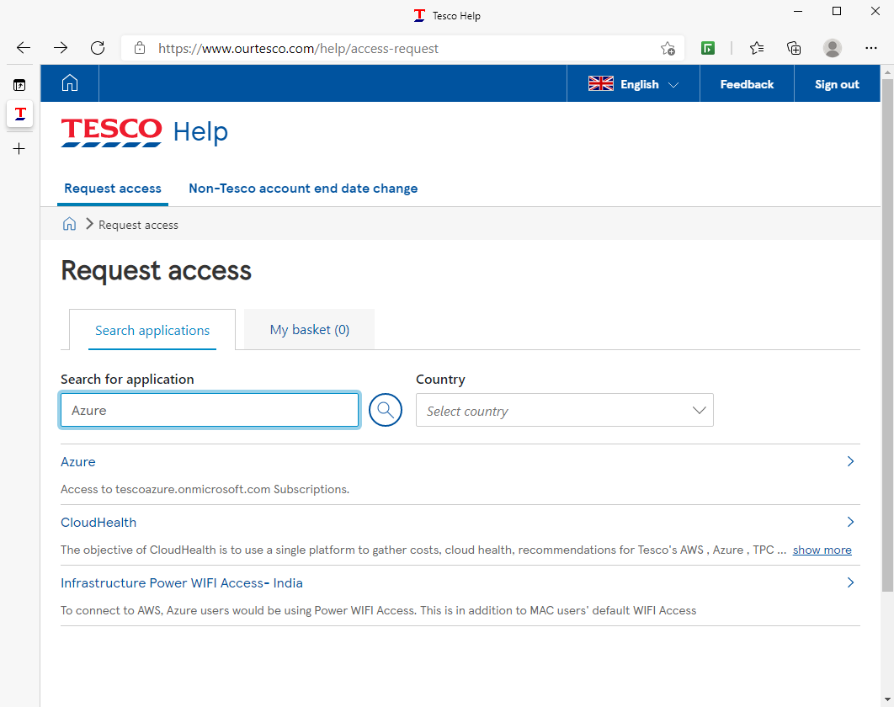
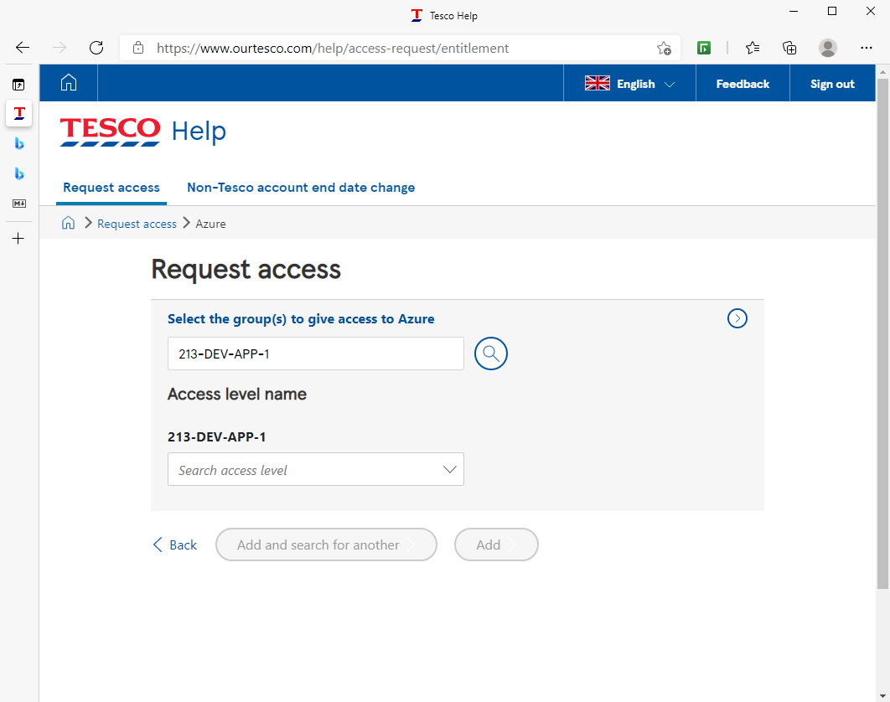
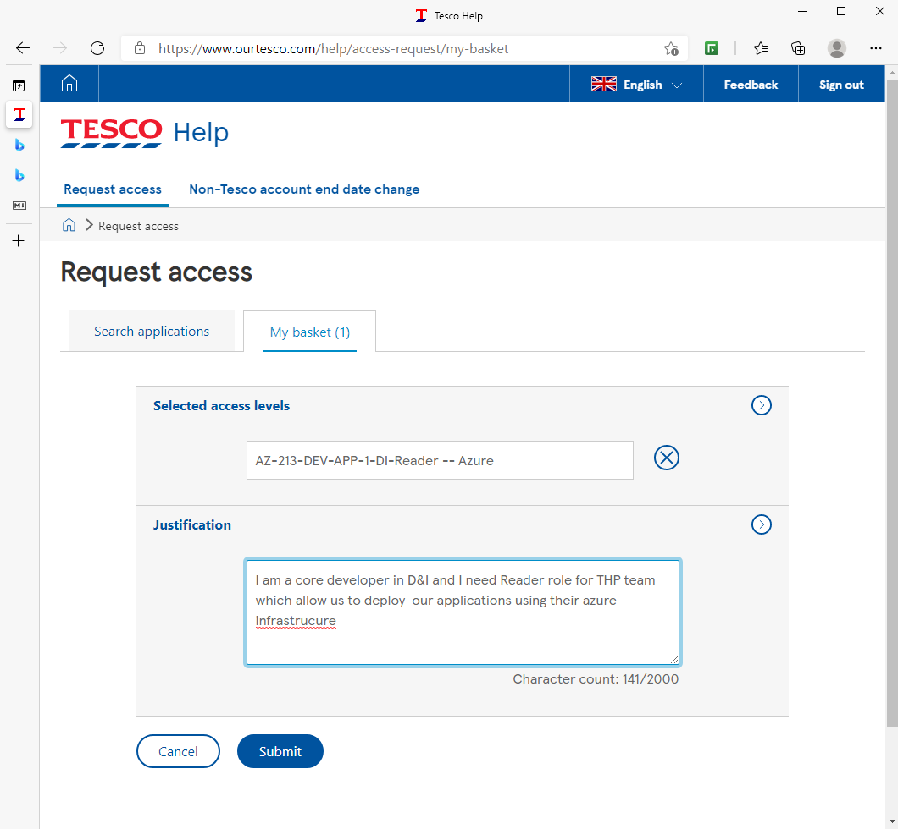

# Diversity And Inclusion

`Docker Compose Configuration (Azure Env)`

## Required access premissions

> User must request access to azure subscription. Subscription name: `213-DEV-APP-1`

1. Go to [Ourtesco Access Request](https://www.ourtesco.com/help/access-request) page

   

   And type `Azure` in *Search for application* box

2. Then in sectio *Select the group(s) to give access to Azure* type name of subscription `213-DEV-APP-1`

   

3. Then request for adding to these AD groups:
   - `AZ-213-DEV-APP-1-DI-Reader`
   - `AZ-213-PROD-APP-1-DI-Reader` (is not yet available, will be added soon)

   Use this sample as business justification:

   > I am a core developer in <TEAM_NAME> and I need Reader role for THP team which allow us to deploy 
   > our applications using their azure infrastrucure 

   

## Install required tools. 

Why it is required? becuase you will need to encrypt/decrypt secrets using Azure key vault 
   together with mozilla/sops tool, so please install also 2 CLI:

   - [az-cli](https://docs.microsoft.com/en-us/cli/azure/install-azure-cli)
   - [sops](https://github.com/mozilla/sops)

   After getting access to Azure with tenant/directory **TescoAzure** you will see subscription `213-DEV-APP-1`

## Login into azure

1. To login into Azure account, open console and type:

        az login

    Then follow instructions on web-page.

2. To login into Azure Container registry you need to know name of subscription and name of registry.

   For our env. we have his settings:
   - Subscription name: `213-DEV-APP-1`
   - Registry name: `euwdev213daicontainerregistry`

   Then open console and type:

        az acr login --subscription 213-DEV-APP-1 -n euwdev213daicontainerregistry

   Now you shoud be able to pull docker images from registry. To do it just open console and type:

        docker pull euwdev213daicontainerregistry.azurecr.io/dev/<IMAGE_NAME_WITH_TAG>
